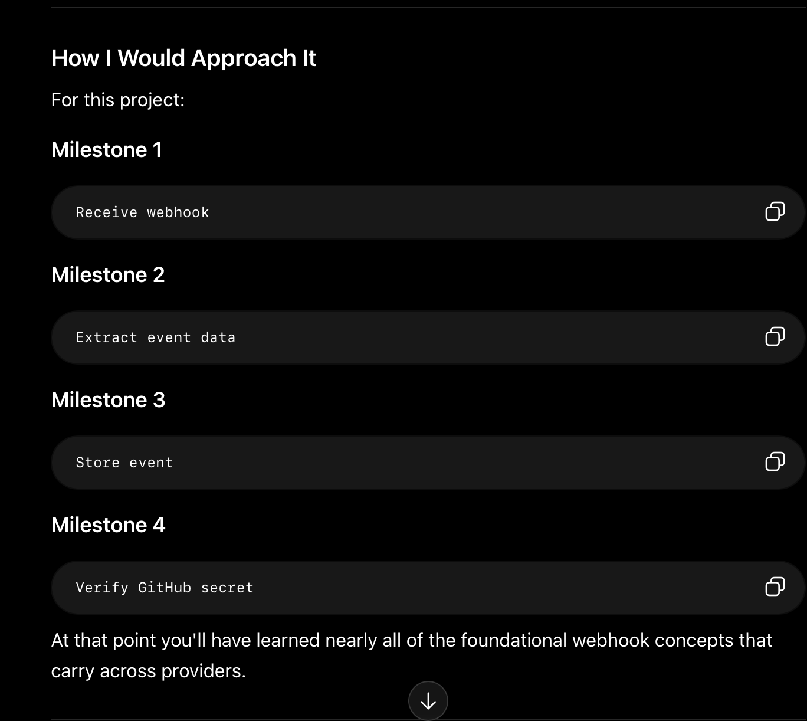

# webhooks-project
not an AI generated code project. personally interacted with--learning webhooks to apply it to my job.


## resources

- https://www.mailslurp.com/blog/what-is-a-webhook/

- https://docs.github.com/en/webhooks/about-webhooks

- https://docs.github.com/en/webhooks/webhook-events-and-payloads

- https://docs.github.com/en/webhooks/using-webhooks/validating-webhook-deliveries

- https://docs.spring.io/spring-framework/reference/web/webmvc.html

- https://developer.mozilla.org/en-US/docs/Web/HTTP/Guides/Overview

## goals

Be able to clearly explain:

- What a webhook is.
- How GitHub delivers webhook events.

- How Spring Boot receives POST requests.
- How to parse JSON payloads.
- How to read HTTP headers.

- How webhook signature verification works.
- How to transform external API data into internal application models.

## core principles

> * **Events can arrive multiple times.**
> * **Always verify the sender.**
> * **Transform external data into internal models.**
> * **A webhook is a notification that something happened, not the thing itself.**


- a webhook is an event notification, not an API request
- the 3rd party pushes to the client, instead of the client making the request to the 3rd party
- **webhooks follow an *at least once* pattern, which means it's extremely important that the design enoforce idempotency (process once, ignore duplicates)**
- the payload usually provides excellent resources for enforcing idempotency
- providers use signatures to authenticate they are who they say they are
- respond quickly, process async (tell them they did it right, then do your process work)
- treat webhook data like user input (still needs null handling, etc)
- logging is part of the feature


- most integrations are "receive, transform, act"
  - receive webhook (GitHub push), transform data, perform action (create Slack message)

- what starts the process (input, receive); what is the outcome (output, act), and what must be done to get there (transform, process)

- webhooks are event-driven thinking
  - ties well into the ***Kafka JPMC project from the winter***
  - event-driven architecture
  - message queues
- webhooks are like raw HTTP-based pub/sub, except there's no broker (Kafka, Rabbit, etc.)

## plan

- subscribe to the GitHub on push webhook by registering a webhook URL
- whenever that repo is pushed to, Github notifies this application

### From GitHub [https://docs.github.com/en/webhooks/about-webhooks]

> When you create a webhook, you specify a URL and subscribe to events that occur on GitHub. When an event that your webhook is subscribed to occurs, GitHub will send an HTTP request with data about the event to the URL that you specified. If your server is set up to listen for webhook deliveries at that URL, it can take action when it receives one.
>
> For example, you could subscribe your webhook to events that occur when code is pushed to a repository, a pull request is opened, a GitHub Pages site is built, or a new member is added to a team. Your server could respond by deploying code to production, triggering a CI pipeline, sending a notification, or creating a GitHub project for the new team member.
>
> You must create a webhook within a specific repository, organization, GitHub Marketplace account, GitHub Sponsors account, or GitHub App. The webhook can only access resources that are available in the repository, organization, GitHub Marketplace account, GitHub Sponsors account, or GitHub App where it is installed.


### some initial questions

- what's an ngrokurl? we'll be using this as the url we provide to GitHub

> An ngrok URL is a secure, public-facing URL (typically https://ngrok-free.app) that acts as a tunnel to a service running on your local machine. It bypasses NATs and firewalls, allowing you to instantly share local development websites, webhooks, or services with anyone on the internet. ~ Google

- Learning HMAC verification will be valuable for securing webhooks, is that in-scope for this project?

- Build the consumer first, then connect the publisher.

- this is pub/sub without a broker, sent over http

### building the consumer

- ***key question***: how do i know where to start? how do i know what pieces are important and where?
  - this is an integration between GitHub and my application. I'm not calling them, they're calling me. they're sending the request. I'm sending the response. they're gonna be sending ... what? how do i know?

  - *pull up the docs on "on push" webhook for GitHub*
  - https://docs.github.com/en/webhooks/webhook-events-and-payloads#push
    - this shows the fields required for the request.
  - https://docs.github.com/en/rest/repos/webhooks?apiVersion=2026-03-10#create-a-repository-webhook
    - this shows the endpoint that GitHub will be making the `POST` call to:
    - `/repos/{owner}/{repo}/hooks`
    ```
    curl -L \
     -X POST \
    -H "Accept: application/vnd.github+json" \
    -H "Authorization: Bearer <YOUR-TOKEN>" \
    -H "X-GitHub-Api-Version: 2026-03-10" \
    https://api.github.com/repos/OWNER/REPO/hooks \
    -d '{"name":"web","active":true,"events":["push","pull_request"],"config":{"url":"https://example.com/webhook","content_type":"json","insecure_ssl":"0"}}'
    ```
    - response schema: `response-push-example.json`

- i can test the GitHub webhook on postman first

- https://www.postman.com/api-evangelist/github/request/qavp5jt/test-the-push-repository-webhook?sideView=agentMode

- since i know they're gonna be sending me a `POST`, I at least know I'll need a controller for that. we can start there.

- USE RESPONSE ENTITY IN WRITING YOUR CONTROLLERS

- without nGrok, GitHub won't be able to reach localhost 8080


- configured nGrok by installing, adding auth key, and accessing public url set to localhost8080. ensuring /health still works and returns "UP."

- added controller for GitHub webhook handler, super simple: just returns a 200 and says "webhook received."
  - endpoint: /webhooks/github
  - base url with ngrok: https://strudel-slab-line.ngrok-free.dev
  - currenlty all this endpoint does is return "webhook received" to any request made to that endpoint. no security. no verification. at all.

  - ***payload url***: https://strudel-slab-line.ngrok-free.dev/webhooks/github


- now we have a url to take to GitHub and set up the webhook with.
  - repo settings -> webhooks -> add new webhook
  - SET CONTENT TYPE TO application/JSON
  - configure SECRET


- secret is where we run into HMAC and security. we're gonna pause on that and come back to it after we get this flow going:
  - receive webhook, parse JSON, log event.
  - then we'll cover: signature verification



- https://docs.github.com/en/webhooks/using-webhooks/handling-webhook-deliveries
- this is an excellent doc for setting up a webhook project and learning it

> In order to handle webhook deliveries, you need to write code that will:
> - Initialize your server to listen for requests to your webhook URL
> - Read the HTTP headers and body from the request
> - Take the desired action in response to the request


> Respond to indicate that the delivery was successfully received. Your server should respond with a 2XX response within 10 seconds of receiving a webhook delivery. If your server takes longer than that to respond, then GitHub terminates the connection and considers the delivery a failure.

- responseEntity
- requestHeader
- requestBody
- try/catch blocks
- return ResponseEntity.status(HttpStatus.ACCEPTED)
- global error handler ?
- separate method for handling webhook (keep this in SERVICES though)


- Github is now successfully sending the webhook to the configured url. but we're not receiving it correctly because our endpoint is very minimal.

- the missing pieces are @RequestHeader, @RequestBody


- also very important: `X-Github-Event` in the headers tells us what event we're receiving

- you can use Map<String, String> for logging the headers

- with Lombok's `@Slf4j`, a `log` object is immediately available with methods like `log.info()` and `log.error()`

note on logging:

```
// ❌ Instead of expensive string concatenation
logger.info("User " + username + " failed to log in from IP " + ipAddress);

// ✅ Use SLF4J placeholders
logger.info("User {} failed to log in from IP {}", username, ipAddress);
```

- now the endpoint is properly logging the event received. now we get to build the DTO that decides "what information from the massive payload do we actually want?"

```
    @PostMapping("/github")
    public ResponseEntity<GitHubWebhookResponse> handleGitHubWebhook(@RequestHeader Map<String, String> headers,
                                                                     @RequestBody String body) {                   // will change to `GitHubRequestDTO`
        // TO DO: add method for async call to service to handle webhook processing
        log.info("Received webhook from GitHub, headers: {}", headers);
        log.info("Received webhook from GitHub, raw body: {}", body);

        return ResponseEntity.ok(new GitHubWebhookResponse("Webhook received"));
    }
```

- in building the dto i don't know how to make sure it properly accesses the fields sent in the json. the json seems like a very complex shape with a lot of nesting. what are some good steps to take?

- ***what do we actually want to log, of the options available? then we'll decide from their list how to access it.***

  - repository name
  - sender
  - author
  - date of some sort?
  - commit hash

what options are avaiable from their payload?

- ref
- before
- after
- repository.full_name
- git_url
- pusher.name


**nested records in Java**

- first of all, `record` is better than class for DTOs.
- but we're gonna stick with class because record is beyond the scope of this exercise


- class DTOs with Lombok: @Data, @Builder, @
